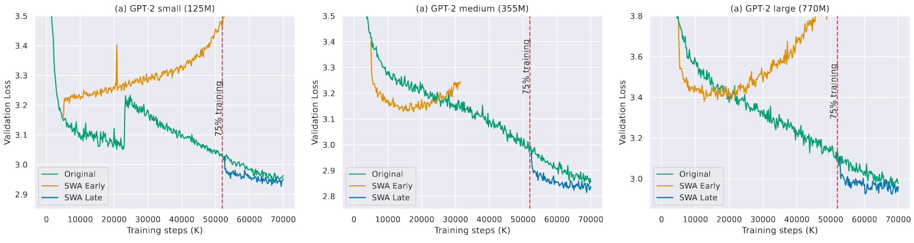
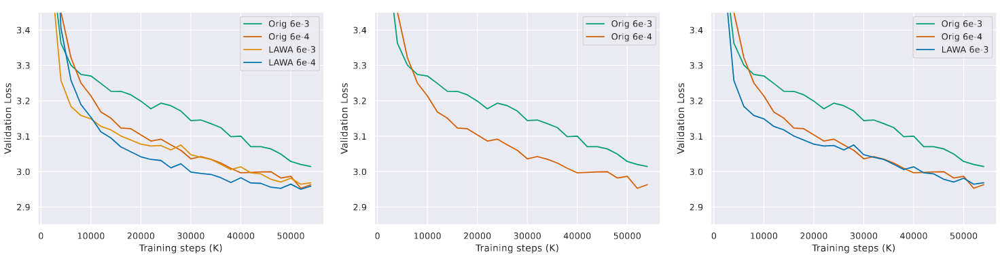

# Early Weight Averaging 
Pre-train Large Language Models (LLMs) faster with Early Weight Averaging.

## Abstract
Training Large Language Models (LLMs) incurs significant cost, making strategies that accelerate model convergence highly valuable. In our research, we focus on the impact of checkpoint averaging along the trajectory of a training run to enhance both convergence and generalization early in the training process. We observe that models trained with high learning rates benefit more from checkpoint averaging. This effect is further intensified when checkpoints are sampled with substantial spacing in training steps. Our training method surpasses conventional training and popular checkpoint averaging baselines such as exponential moving average (EMA) and stochastic moving average (SWA). We demonstrate the efficacy of our approach by pre-training nanoGPT-2 models of various sizes—small (125M), medium (335M), and large (770M)—on the OpenWebText dataset, consisting of 9 billion tokens. We also present results for publicly available Pythia LLMs, ranging from 1 billion to 12 billion parameters, trained on the PILE-deduped dataset containing 207 billion tokens.

## Data Preparation
Prepare the [OpenWebText](https://huggingface.co/datasets/openwebtext) data following [nanoGPT](https://github.com/karpathy/nanoGPT/):
```
$ python data/openwebtext/prepare.py
```

## Training Script for Small nanoGPT-2

##### Normal Training & EMA
To train a small nanoGPT-2 model (also runs an EMA variant), use the following command:
```bash
torchrun --standalone --nproc_per_node=3 train_small.py
```
Similarly, for medium and large:
```bash
torchrun --standalone --nproc_per_node=3 train_medium.py
torchrun --standalone --nproc_per_node=3 train_large.py
```
Note: The above scripts automatically saves checkpoints at a specified interval.

##### LAWA Checkpoint Averaging

Run LAWA on already saved checkpoints:
```bash
torchrun --standalone --nproc_per_node=3 lawa.py
```
Please refer to the large and medium configurations of the EMA scripts for running large and medium versions SWA and LAWA.


##### SWA training

To train a small nanoGPT-2 model with SWA, use the following command:
```bash
torchrun --standalone --nproc_per_node=3 train_swa.py
```
Loss curves for Normal training, EMA and SWA:
<p align="center" width="100%">
      
</p>

Loss curves for LAWA:
<p align="center" width="100%">
      
</p>


## Dependencies
- [pytorch](https://pytorch.org) 2.0
- transformers
- datasets
- tiktoken
- wandb

## Cite
If you find this work helpful, please consider citing us:

```
@inproceedings{
sanyal2024early,
title={Early Weight Averaging meets High Learning Rates for {LLM} Pre-training},
author={Sunny Sanyal and Atula Tejaswi Neerkaje and Jean Kaddour and Abhishek Kumar and sujay sanghavi},
booktitle={First Conference on Language Modeling},
year={2024},
url={https://openreview.net/forum?id=IA8CWtNkUr}
}
```

## Acknowledgement
The training code is mainly adapted from [Sophia](https://github.com/Liuhong99/Sophia/) and [nanoGPT](https://github.com/karpathy/nanoGPT/).
